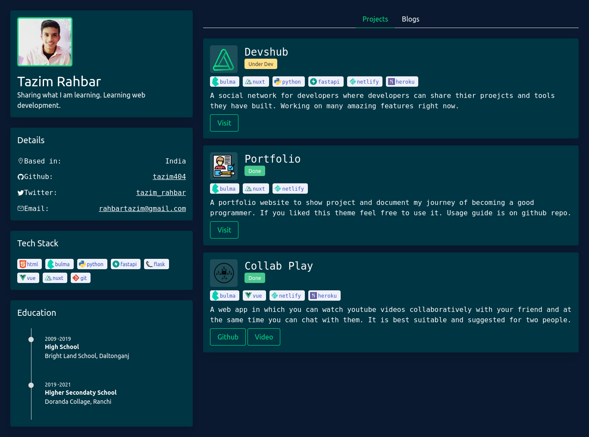

# [PORTFOLIO](https://tazim.netlify.app/)



This portflio is built by keeping simplicty in mind with very easy way configure it contents.

## Build Setup

```bash
clone the repo
# install dependencies
$ npm install

# serve with hot reload at localhost:3000
$ npm run dev

# generate static project
$ npm run generate
```

### `How to change contents`

To chnage the content of portfoio according to your need simply go to `store/portfolio.js` and edit the properties.

All the logos that your are seeing in that is being impoted `store/portfolio.js` are stored in `assets/icons` and `assets/images` folders and you have to chnage accoridng to your prefernces.
